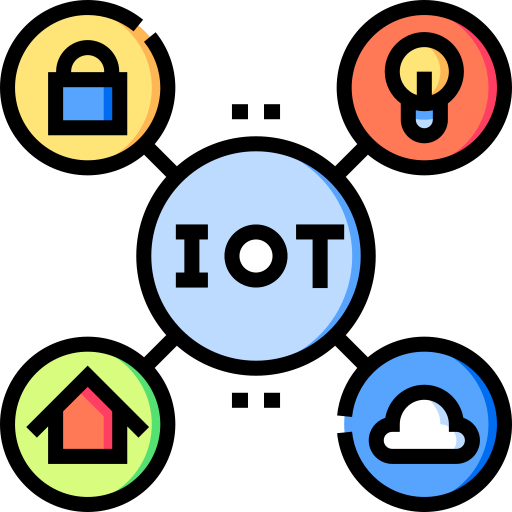

<!--- 
- 👋 Hi, I’m @Mohammadjavadv
- 👀 I’m interested in Embeded system & IOT
- 💻 I’m currently learning Web Programming
- 📫 How to reach me mohammadjavadv1386@gmail.com
--->
<!---
Mohammadjavadv/Mohammadjavadv is a ✨ special ✨ repository because its `README.md` (this file) appears on your GitHub profile.
You can click the Preview link to take a look at your changes.
--->

<h1>👋 Hi, I’m Mohmmad Javad Vatan Khahan 👨🏽‍💻</h1>
 <h2>💻 I’m interested in Embeded system & IOT</h2>

  
  

<h2>My Skills: </h2>

<picture>
  <source media="(prefers-color-scheme: dark)" srcset="https://raw.githubusercontent.com/Mohammadjavadv/Mohammadjavadv/output/pacman-contribution-graph-dark.svg">
  <source media="(prefers-color-scheme: light)" srcset="https://raw.githubusercontent.com/Mohammadjavadv/Mohammadjavadv/output/pacman-contribution-graph.svg">
  
</picture>

